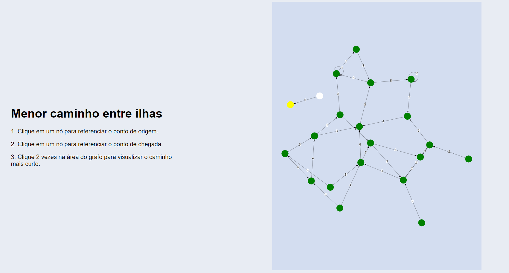

# FastRide

**Número da Lista**: X 
**Conteúdo da Disciplina**: Grafos 2 

## Alunos

| Matrícula  | Aluno                           |
| ---------- | ------------------------------- |
| 18/0122606 | Isadora Soares                  |
| 18/0042661 | Luís Fernando Furtado de Araújo |

## Sobre

<!-- Sobre o projeto aqui -->

## Screenshots

## Instalação

**Linguagem**: JavaScript 
**Framework**: ReactJS 

#### Clone o repositório

#### Instruções para rodar o projeto a primeira vez localmente

`Verificar se a versão do node na sua máquina se encontra na versão v16.15.1 para conseguir instalar as dependências.`

`npm install`

`npm start`

Após realizar esses passos, o site estará rodando na porta 3000.

## Uso

#### Para rodar o projeto a partir da segunda vez

`npm start`

Após realizar esses passos, o site estará rodando na porta 3000.

## Apresentação

Link da apresentação:
